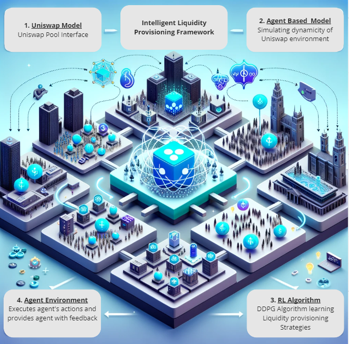
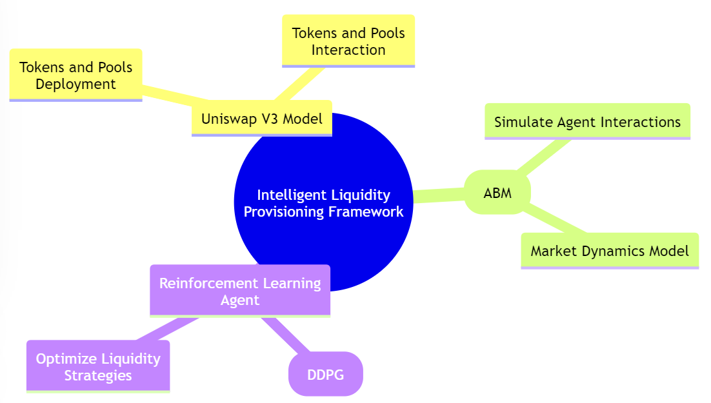

# Intelligent Liquidity Provisioning Framework - Reinforcement Learning Approach to Optimize Liquidity Provisioning on Uniswap V3 Pools

# Initial Setup

## Prerequisites

- Linux/MacOS
- Python 3.9.18
- solc 0.7.6+ [[Instructions](https://docs.soliditylang.org/en/v0.8.9/installing-solidity.html)]
- ganache. To install: `npm install ganache --global`
- nvm 16.13.2, _not_ nvm 17. To install: `nvm install 16.13.2; nvm use 16.13.2`

## Handling Line Endings for Cross-Platform Compatibility

When cloning the repository on Windows, line ending differences can cause unexpected behavior in scripts. If you encounter an issue with running scripts due to line ending problems, you may need to convert them manually. On Unix systems, you can use the dos2unix utility, or manually convert them using a text editor that supports line ending conversion.
Before you clone the repository, run the following command in your Git Bash terminal to ensure Git converts line endings appropriately:

```console
git config --global core.autocrlf true
```
## Setup TokenSPICE ABM

Open a new terminal and:
```console
#clone repo
git clone https://github.com/idrees535/Intelligent-Liquidity-Provisioning-Framework-V1

#create a virtual environment
python3 -m venv ilp_venv

#activate env
source ilp_venv/bin/activate

#install dependencies
pip install -r requirements.txt

#install brownie packages 
./brownie-install.sh
```

## Run Ganache

```console
source venv/bin/activate
#add pwd to bash path
export PATH=$PATH:.

#run ganache
./ganache.py
```
This will start a Ganache chain, and populate 9 accounts.

## Compile contracts

Open a new terminal and:
```console
./compile.sh
```
This will compile contracts

### Additional Steps
1. Change path in UniswapV3_Model_V2.py module and rl_lp_agent.ipynb notebook to root directory of you cloned project 

### Initialize ABM with Specific Pool

```console
from netlists.uniswapV3.netlist import SimStrategy,SimState,netlist_createLogData
from util.globaltokens import weth_usdc_pool,eth_dai_pool,btc_usdt_pool
from engine.SimEngine import SimEngine

sim_strategy = SimStrategy()
sim_state = SimState(ss=sim_strategy,pool=weth_usdc_pool)

output_dir = "model_outdir_csv"
netlist_log_func = netlist_createLogData

engine = SimEngine(sim_state, output_dir, netlist_log_func)
```

### Run ABM

```console
engine.reset()
engine.run()
```


## RL Agent - Instructions

1. model_notebooks/rl_lp_agent.ipynb notebook contains RL agent environemnt and DDPG defined with it's training and evaluation 
2. (No need to run reset env cell for first run or any subsequent run until you want to refresh/delete deployed pools/tokens)
3. util/globaltokens.py module loads brownie compiled project from util/constants.py and deploys pools using model_scripts/UniswapV3_Model_V2.py class, which are being imported in model_notebooks/rl_lp_agent_ipynb to tarin RL agent
4. model_outdir_csv directory contains csv data of ABM, RL Agnt training and evaluation
5. model_storage directory contains  tensorboard RL agent training logs, saved actor critic models, liq_positions.json (contains local storage of all liquiidty position agent wise and pool wise), token_pool_addresses.json (contains deployed token and pool addresses in local storage)
6. For more details about setup and configuration of Tokenspice Agent based Simulator, refer to tokenspice official Github Repo: https://github.com/tokenspice/tokenspice
7. model_scripts/agent_policies.py defines the policies of Uniswap agents (trader and liquidity provider)
8. model_scripts/plot.py contains visualization functions of training and evaluation
9. model_notebooks/tsp_abm.ipynb notebook cofigures and runs tokenSPICE ABM to simulate and test any baseline liquiidty provisoining strategies 

# Abstract
Liquidity provisioning in Uniswap V3 presents a stochastic optimal control problem with a well-defined utility function to maximize. This article introduces an innovative framework for intelligent liquidity provisioning, utilizing a combination of agent-based modeling and reinforcement learning. Our framework provides a robust and adaptive solution for optimizing liquidity provisioning strategies. The Uniswap V3 model mimics real-world market conditions, while the agent-based model (ABM) creates an environment for simulating agent interactions with Uniswap V3 pools. The reinforcement learning agent, trained using deep deterministic policy gradients (DDPG), learns optimal strategies, showcasing the potential of machine learning in enhancing DeFi participation. This approach aims to improve liquidity providers' profitability and understanding of CFMM markets.

# Introduction
In my previous article on market making [Market Making Mechanics and Strategies], we explored the mechanics and strategies of market making in traditional financial markets. Building upon those insights, this article introduces an innovative framework for intelligent liquidity provisioning in the context of Uniswap V3. As mentioned in our prior research, our goal was to extend our understanding of market dynamics and liquidity management in decentralized finance (DeFi), specifically through the development of the Intelligent Liquidity Provisioning Framework.
Decentralized finance (DeFi) has undergone remarkable growth, introducing innovative financial products and services accessible to a global audience. Uniswap V3, at the forefront of this innovation, has revolutionized liquidity provisioning with its concentrated liquidity feature. However, this advancement brings forth complex decision-making challenges for liquidity providers. This article introduces a comprehensive framework designed to address these challenges, offering a simulated environment for studying and optimizing liquidity provisioning strategies.
Our framework comprises three key components: the Uniswap V3 model, an agent-based model (ABM), and a reinforcement learning agent. The Uniswap V3 model provides a representation of the pool, enabling the deployment and interaction with tokens and pools. The ABM introduces complexity by simulating agent interactions and market dynamics, creating a rich environment for strategy evaluation. The reinforcement learning agent, operating within this environment, adopts a deep deterministic policy gradient approach to learn and adapt strategies, aiming for optimal performance in liquidity provisioning.



ILP FrameworkThis research aims to develop an intelligent liquidity provisioning (ILP) mechanism using reinforcement learning (RL) to autonomously manage and optimize liquidity within the Uniswap V3 environment. The mechanism seeks to maximize the utility function, considering fees earned, impermanent loss, and other metrics based on liquidity providers' preferences while adapting to the complex dynamics of the CFMM market.

# Intelligent Liquidity Provisioning Framework
In the RL framework, the liquidity provisioning problem is formulated as a Markov Decision Process (MDP). The MDP consists of states, actions and rewards.By applying RL algorithm, the liquidity provisioning mechanism can learn and adapt to changing market conditions, identify optimal liquidity provision strategies, and balance constraints and preferences specified by the liquidity provider. RL enables the mechanism to find solutions that maximize the liquidity provider's objective function, considering various trade-offs and constraints in an autonomous and dynamic manner.

#### States:
 States represent the current market conditions, including asset prices, trading volumes, and other relevant variables.
#### Actions:
 Actions correspond to the decisions made by the liquidity provider, such as adjusting liquidity allocations, rebalancing portfolios etc.
#### Rewards:
 Rewards quantify the desirability of the outcomes based on the liquidity provider's objective function, preferences, and constraints. The rewards can be positive for desirable outcomes (e.g., high returns) and negative for undesirable outcomes (e.g., high risk or underperformance).
#### Objective Function:
 The objective function represents the liquidity provider's desired outcome, which can be a combination of factors like maximizing returns, minimizing risks, or achieving a specific trade-off between the two. Constraints can include limitations on liquidity allocations, capital utilization, risk tolerance levels, or other restrictions defined by the liquidity provider.

RL training is an iterative process where the agent continuously updates its policy based on feedback. The agent learns from its experiences and refines its decision-making over time, gradually converging to more optimal liquidity provisioning strategies. Once the RL agent has been trained, it can be tested and evaluated using historical data or simulated environments to assess its performance against the liquidity provider's objective function and constraints. The agent's performance can be measured using metrics like returns, risk measures, or other relevant performance indicators.

# Components of Intelligent Liquidity Provisioning Framework
The framework comprises three major components:

## UniswapV3 Model
The Uniswap V3 model implemented in Python offers a detailed and functional simulation of the Uniswap V3 protocol, capturing its nuanced mechanics and providing users with a comprehensive toolset for interacting with the protocol. The UniswapV3_Model class handles the deployment of tokens and pools, initializes pools, and provides an interface for pool actions and pool state retrieval.
### Overview
The Uniswap Model serves as the foundation of the Intelligent Liquidity Provisioning Framework, encapsulating the core mechanics of Uniswap V3. It leverages compiled smart contracts from Uniswap's V3-Core, deployed in a local Ganache environment using brownie, to create a realistic and interactive simulation. 
### Contract Compilation and Deployment
The framework integrates with Brownie, a Python-based development and testing framework for smart contracts, to compile and deploy the Uniswap V3 smart contracts. These contracts are then deployed to a local Ganache environment, providing a sandbox for testing and development. This setup ensures that users can interact with the Uniswap environment without the need for real assets or network transactions, fostering a safe and controlled experimentation space.
## Agent Based Simulator
Tokenspice agent based simulator is used to simulate Uniswap V3 environment, agent policies are defined to incorporate the dynamics of a uniswap market participants. Different type of agents are used to simulate the dynamic uniswap environment
### Introduction
Tokenspice Agent-Based Model (ABM) simulates the actions and interactions of individual agents within the Uniswap V3 ecosystem. By modeling the complex behaviors of different participants, the ABM provides a comprehensive interface of Uniswap V3 dynamic environment, enabling the analysis and optimization of liquidity provisioning strategies.
### Agent Types and Behaviors
The ABM includes various agent types, each representing a specific role within the Uniswap V3 ecosystem. The two main agents are the Liquidity Provider Agent and the Swapper Agent, which interact with the Uniswap pools to provide liquidity and perform token swaps, respectively. The behavior of these agents is dictated by policies defined in the agents_policies.py module, ensuring that their actions are aligned with real-world strategies and market conditions.
#### Liquidity Provider Agent:
 This agent adds and removes liquidity from the Uniswap pools. It follows a set of policies that dictate its actions based on the current state of the market and the agent's preferences.
#### Swapper Agent:
 The Swapper Agent performs token swaps within the Uniswap pools, taking advantage of price discrepancies and arbitrage opportunities. Its behavior is guided by policies that assess the potential profitability of trades, considering transaction fees and slippage.

### Simulation Configuration and Execution
The netlist.py module is central to the ABM, configuring how agents interact with each other and with the Uniswap pools. It defines the relationships between agents, policies, and the simulation environment.
The SimEngine.py, SimStateBase.py, and SimStrategyBase.py modules provide the foundational elements for running simulations. The SimEngine orchestrates the simulation, managing the flow of time and the execution of agent actions. The SimStateBase maintains the current state of the simulation, storing data on agent holdings, pool states, and other relevant variables. The SimStrategyBase defines the overarching strategies that guide agent behavior throughout the simulation.

## Reinforcement Learning Model
### Introduction
The Reinforcement Learning (RL) Agent is a pivotal component of the Intelligent Liquidity Provisioning Framework, designed to interact with the Uniswap V3 ecosystem through Uniswap Model an agent-based model. This section delves into the RL Agent, its environment, and the DDPG (Deep Deterministic Policy Gradient) algorithm used for training.
### RL Agent Environment
The RL Agent operates in a custom environment, DiscreteSimpleEnv, which interfaces with the Uniswap model and the agent-based model to simulate the DeFi market. This environment facilitates the agent's interaction with Uniswap pools, allowing it to add and remove liquidity, and observe the consequences of its actions. The RL Agent interacts with the Uniswap model and ABM to simulate real-world liquidity provisioning in Uniswap V3. It chooses actions that result in adding or removing liquidity, with policies and simulation configuration defined in the ABM, ensuring realistic interactions.
#### State Space:
 The environment's state space includes various market indicators such as the current price, liquidity, and fee growth. These parameters are normalized and provided to the agent at each timestep.
#### Action Space:
 The agent's action space consists of continuous values representing the price bounds for adding liquidity to a Uniswap pool. These actions are translated into interactions with the Uniswap pools, affecting the state of the environment.
#### Reward Function:
 The reward function is crucial for training the RL Agent. It takes into account the fee income, impermanent loss, portfolio value and potential penalties, providing a scalar reward signal to guide the agent's learning process.

### DDPG Agent
The DDPG Agent is a model-free, off-policy actor-critic algorithm using deep function approximators. It can handle high-dimensional state spaces and continuous action spaces, making it well-suited for our Uniswap V3 environment.
#### Actor Network:
 This network is responsible for providing the best believed action given a state. It has a sigmoid output layer, outputting relative values for price_lower and price_upper which are then scaled to desired range in agent env, representing the price bounds for adding liquidity.
#### Critic Network:
 This network evaluates the action value function, estimating the expected return of taking an action in a given state.
#### Target Networks:
 DDPG employs target networks for both the actor and critic, which are slowly updated to stabilize training.
#### Experience Replay:
 This technique is used to store a replay buffer of past experiences, allowing the agent to learn from a diverse set of samples, breaking correlations in observations, and smoothing out learning.

### Interaction with Uniswap Model and ABM
The RL Agent leverages the Uniswap model and agent-based model to simulate real-world liquidity provisioning in Uniswap V3. It interacts with the Uniswap pools through the DiscreteSimpleEnv, performing actions that result in adding or removing liquidity. The agent's policies and the simulation configuration are defined in the ABM component, ensuring realistic and coherent dynamic environment.
#### Train and Evaluate Agent:
 The agent is trained over a series of episodes, each representing a different market scenario (different pool). The agent's performance is evaluated based on its ability to maximize returns while minimizing risks associated with liquidity provisioning. The effectiveness of the Intelligent Liquidity Provisioning Framework is assessed through evaluation of the reinforcement learning (RL) agent's performance.
#### Environment Setup:
 To evaluate the RL agent, we set up a specialized evaluation environment, DiscreteSimpleEnvEval, which extends the base environment, DiscreteSimpleEnv. This environment is tailored for the evaluation of agent policies. 
#### Baseline Agent:
 In our evaluation setup, we compare the RL agent's performance against that of a baseline agent. The baseline agent's actions are determined by a baseline policy that relies on the current state of the liquidity pool. This agent aims to provide a reference point for evaluating the RL agent's performance.

# Limitations
#### Pools Synchronization:
 Currently, the framework does not fully capture the real-time synchronization of pools, which can lead to discrepancies in modeling real Uniswap V3 dynamics. Future work should focus on incorporating mechanisms for better pool synchronization, potentially utilizing tick/position data or events to enhance realism.

#### Naive Agent Policies:
The agent policies employed in the current framework are relatively simple and naive. To achieve more accurate simulations, future iterations should aim to define more comprehensive agent policies. These policies could model various types of Uniswap agents, such as noise traders, informed traders, retail liquidity providers, and institutional liquidity providers. Alternatively, statistical models trained on historical pool data can inform agent policies for more realistic behavior.

#### Sparse Observation Space:
The observation space provided to the agents lacks comprehensive information about the state of the pool. To improve decision-making capabilities, future enhancements should include tick and position data, along with engineered features that offer agents a more comprehensive understanding of the pool's status.

#### Bounded Action Space:
The action space for agents is currently constrained, with fixed liquidity amounts and restricted price range bounds. Expanding the action space to allow for more flexibility in liquidity provision, as well as considering multiple positions per step, can enhance the fidelity of the simulations.

# Future Work
## Agent Environment:
#### Synced Pools:
 Implement mechanisms to synchronize pools, possibly using tick/position data or events, to create more realistic dynamics in the Uniswap V3 environment.
#### Comprehensive Agent Policies:
 Define more sophisticated analytical policies that accurately model various Uniswap agents or utilize statistical models trained on historical pool data to inform agent behavior.
Informative Observation Space: Enhance the observation space by including tick and position data, and engineer features that provide agents with a comprehensive view of the pool's state.
#### Improved Reward Function:
 Develop an improved reward function that accounts for a wider range of factors, leading to more effective agent training.
## Agent Algorithm:
#### Hyperparameter Tuning:
 Further refine and optimize the hyperparameters of the reinforcement learning agent for better training performance.
Experimentation with Other RL Agents: Explore alternative RL agent models, such as Proximal Policy Optimization (PPO) or Soft Actor-Critic (SAC), to determine if they offer advantages in specific scenarios.
#### Multi-Agent RL (MARL):
 Investigate the application of multi-agent reinforcement learning techniques, which can be beneficial for modeling interactions among multiple liquidity providers and swappers.
#### Online Learning:
 Implement online learning strategies that allow agents to adapt to changing market conditions in real-time, providing a more dynamic and adaptive liquidity provisioning solution.

# Conclusion
In the rapidly evolving landscape of decentralized finance (DeFi), liquidity provisioning plays a pivotal role in enabling efficient and secure trading. Uniswap V3, with its innovative concentrated liquidity feature, has pushed the boundaries of what is possible in DeFi liquidity management. However, the complexities of optimizing liquidity provisioning strategies within this dynamic ecosystem require innovative solutions.
Our Intelligent Liquidity Provisioning Framework represents a significant step forward in addressing these challenges. By combining agent-based modeling and reinforcement learning, we have created a powerful toolkit for liquidity providers and market participants. This framework offers a robust and adaptive solution for optimizing liquidity provisioning strategies, with a focus on maximizing utility functions that encompass fees earned, impermanent loss mitigation, and other metrics tailored to individual preferences.

# References
https://kth.diva-portal.org/smash/get/diva2:1695877/FULLTEXT01.pdf
https://arxiv.org/pdf/2305.15821.pdf
https://github.com/KodAgge/Reinforcement-Learning-for-Market-Making/tree/main
https://arxiv.org/ftp/arxiv/papers/2211/2211.01346.pdf
https://arxiv.org/pdf/2004.06985.pdf
https://ieeexplore.ieee.org/stamp/stamp.jsp?arnumber=9682687
https://journals.plos.org/plosone/article?id=10.1371/journal.pone.0277042
https://deliverypdf.ssrn.com/delivery.php?ID=104119098102026014120072084014107007042068069003049020126088025087121115103007084028042013055035009000054122074096068089064070102052026003014069082076098016080066026088066039027093020006122067093104092065070020126069068106118079127088008098077106031120&EXT=pdf&INDEX=TRUE
https://medium.com/blockapex/market-making-mechanics-and-strategies-4daf2122121c
https://www.gauntlet.xyz/resources/uniswap-user-cohort-analysis
https://gov.uniswap.org/t/uniswap-incentive-design-analysis/21662
https://arxiv.org/pdf/2108.07806.pdf
https://www.researchgate.net/publication/341848292_Market_makers_activity_behavioural_and_agent_based_approach
https://fruct.org/publications/volume-29/fruct29/files/Struc.pdf
https://www.arxiv-vanity.com/papers/1911.03380/
https://insights.glassnode.com/the-week-onchain-week-31-2023/
